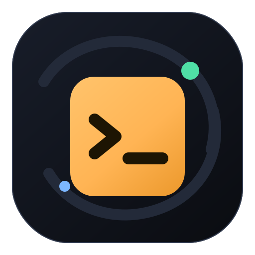
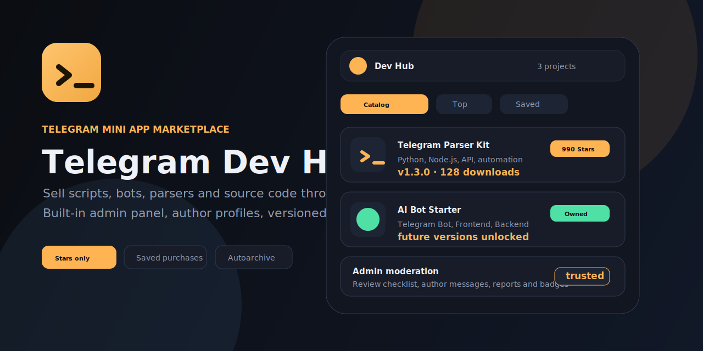

<p align="center">
  
</p>

<h1 align="center">Telegram Dev Hub</h1>

<p align="center">
  Telegram bot + Mini App marketplace for scripts, source code, developer tools and paid project releases.
</p>

<p align="center">
  <a href="#quick-start"></a>
  <a href="#telegram-stars"></a>
  <a href="#docker-deploy"></a>
  <a href="#tests"></a>
</p>

<p align="center">
  
</p>

## Overview

Telegram Dev Hub is a production-ready Telegram bot and Mini App for selling, publishing and managing developer projects. It is built for a single owner or a small team that wants to distribute scripts, parsers, bots, automation tools, AI utilities and source code directly inside Telegram.

The app includes a full catalog, project pages, author profiles, versioned downloads, Telegram Stars monetization, admin moderation, user submissions, reviews, favorites, download history and bot commands.

## Highlights

- Telegram bot with `/start`, `/new`, `/top`, `/saved`, `/profile`, `/id`.
- React/Vite Telegram Mini App with catalog, filters, profile, saved projects, history and notifications.
- Project marketplace for free, paid, subscription and VIP-only releases.
- Payments through Telegram Stars only. No RUB labels, no mixed currencies.
- One-time project purchase is saved to the user account.
- Buyers can download all future versions of a purchased project without paying again.
- Public project pages: `/project/:slug`.
- Public author pages: `/:username`.
- Browser-opened public links can redirect users into the Telegram bot.
- Author profiles with verification, trusted and top seller badges.
- User submissions for publishing projects.
- Auto-approval for verified, trusted or top seller authors.
- Owner dashboard: edit own projects, upload new versions, add/remove screenshots.
- Admin panel with project creation, moderation, user control, reports and monetization.
- File review checklist, hidden files, deleted files and admin notes.
- Autoarchive download with generated `README.md`, `LICENSE.txt` and `SIGNATURE.txt`.
- README preview on project pages.
- Weekly picks and seasonal Stars discounts.
- Promo codes, subscriptions, VIP access and manual grants.
- Download logs, download limits and purchase history.
- Malware/problem reports for projects and author reports.
- SQLite storage with automatic migrations.
- Docker-ready for VPS deployment.

## Feature Map

### Catalog

- Search by title, language, tags, price and date.
- Filters for Python, Node.js, PHP, Telegram Bot, API, Frontend and Backend.
- Collections: bots, parsers, automation, AI.
- Top projects by activity.
- Weekly picks and pinned projects.
- Seasonal sales in Telegram Stars.

### Project Page

- Title, description, summary and screenshots.
- Version, changelog and versioned files.
- Installation guide and launch examples.
- OS and dependency requirements.
- Node.js/Python version requirements.
- License type: free, personal, commercial.
- Code preview or demo snippet.
- Links: GitHub, demo, docs, video.
- Ratings, reviews and comments.
- Problem report button.
- Telegram Mini App share card.
- Auto-generated README preview.

### Authors

- Public profile by username.
- Verified, trusted and top seller badges.
- Project count and author statistics.
- User can report an author.
- Admin can message an author about project issues.
- Trusted authors can be auto-approved.

### Buyer Access

- Free projects can be limited per day for regular users.
- Paid projects are bought once through Telegram Stars.
- Purchased projects stay in the account forever.
- New versions remain downloadable for existing buyers.
- VIP and subscription tiers can unlock protected projects.
- Promo codes can grant access to a project, subscription or VIP.

### Admin Panel

- Create, edit, hide, archive and pin projects.
- Draft and pending states before publication.
- Upload latest file, versions, screenshots and extra files.
- Hide or delete individual uploaded files.
- Hide or delete individual project versions.
- Review uploads with a checklist:
  - archive opens
  - README exists
  - license exists
  - no secrets
  - dependencies checked
- Send moderation message to project author.
- Ban and unban users.
- Verify users and assign trusted/top seller badges.
- Moderate reviews and reports.
- Broadcast messages to all users.
- View purchases and confirm pending purchases.
- View download logs and project statistics.

## Tech Stack

| Layer | Technology |
| --- | --- |
| Bot | Telegraf |
| API | Express |
| WebApp | React + Vite |
| Icons | Lucide React |
| Database | SQLite |
| Uploads | Local filesystem |
| Auth | Telegram WebApp init data |
| Payments | Telegram Stars invoices |
| Deploy | Docker / Docker Compose |

## Project Structure

```text
.
├── src/
│   ├── client/              # React Mini App
│   │   ├── App.jsx
│   │   ├── api.js
│   │   ├── main.jsx
│   │   └── styles.css
│   └── server/              # Express API, bot, DB and monetization
│       ├── index.js
│       ├── db.js
│       ├── monetization.js
│       ├── botCommands.js
│       ├── security.js
│       ├── storage.js
│       └── fileSecurity.js
├── docs/assets/             # GitHub preview assets
├── public/                  # Vite public assets
├── work/                    # Functional and security checks
├── Dockerfile
├── docker-compose.yml
└── package.json
```

## Quick Start

Requirements:

- Node.js 24+
- npm
- Telegram bot token for production

Install dependencies:

```bash
npm install
```

Create environment file:

```bash
cp .env.example .env
```

Run development mode:

```bash
npm run dev
```

API runs on:

```text
http://localhost:7870
```

In development mode `/api/auth/dev` is enabled. If `ADMIN_TELEGRAM_IDS` is empty, the dev user becomes admin.

## Production Environment

Recommended `.env` for VPS:

```env
NODE_ENV=production
PORT=7870

BOT_TOKEN=123456789:your_token
BOT_USERNAME=your_bot_username_without_at
BOT_APP_NAME=devhub

WEBAPP_URL=https://your-domain.example
ADMIN_TELEGRAM_IDS=123456789
SESSION_SECRET=replace_with_64_random_hex_chars

DB_PATH=/app/data/app.sqlite
UPLOADS_DIR=/app/data/uploads
MAX_UPLOAD_MB=100

ALLOW_DEV_AUTH=false
ALLOW_TEST_CHECKOUT=false

FREE_DAILY_DOWNLOAD_LIMIT=5
SUBSCRIPTION_DAYS=30
SUBSCRIPTION_STARS=499
VIP_DAYS=0
VIP_STARS=1990
```

Generate a session secret:

```bash
openssl rand -hex 32
```

## Docker Deploy

Build and run:

```bash
docker compose up -d --build
```

The compose file binds the app to `127.0.0.1:7870`, so you can put Caddy or Nginx in front of it.

Example Caddy config:

```caddy
your-domain.example {
  reverse_proxy 127.0.0.1:7870
}
```

Telegram Mini Apps must be served through HTTPS in production.

## Telegram Setup

1. Create a bot with [@BotFather](https://t.me/BotFather).
2. Copy the token into `BOT_TOKEN`.
3. Set `BOT_USERNAME` without `@`.
4. Configure the Web App URL in BotFather.
5. Set `WEBAPP_URL=https://your-domain.example`.
6. Start the app and send `/id` to the bot.
7. Copy your Telegram numeric ID into `ADMIN_TELEGRAM_IDS`.

Useful bot commands:

| Command | Description |
| --- | --- |
| `/start` | Opens the main bot menu with Mini App button |
| `/app` | Sends the Mini App button again |
| `/new` | Shows latest projects |
| `/top` | Shows popular projects |
| `/saved` | Shows user's saved projects |
| `/profile` | Shows account, access and public profile link |
| `/id` | Shows Telegram numeric ID |

## Telegram Stars

Telegram Dev Hub uses Telegram Stars as the only payment currency.

Supported monetization flows:

- Buy project source once.
- Download future versions after purchase.
- Subscription access.
- VIP access.
- Promo code unlocks.
- Admin manual grants.
- Seasonal Stars discounts.

For local tests you can set:

```env
ALLOW_TEST_CHECKOUT=true
```

For production keep it disabled:

```env
ALLOW_TEST_CHECKOUT=false
```

## Data Storage

Runtime data is stored outside Git:

```text
data/app.sqlite
data/uploads/packages
data/uploads/screenshots
```

The app automatically creates and migrates SQLite tables/columns on startup.

## Tests

Build and syntax check:

```bash
npm run check
```

Full functional check:

```bash
npm run test:functional
```

Security and upload checks:

```bash
node work/security-check.mjs
```

The current functional test suite covers 35 end-to-end scenarios, including:

- project creation
- user submissions
- trusted author auto-approval
- owner edits
- file/version moderation
- saved purchases
- future paid versions
- Telegram Stars payloads
- promo codes
- subscription and VIP access
- reports, reviews and download logs
- bot command payloads

## Security Notes

- Never enable `ALLOW_DEV_AUTH=true` on a real VPS.
- Never commit `.env`, `data/`, uploaded files or SQLite databases.
- Use HTTPS for `WEBAPP_URL`.
- Restrict admin panel with `ADMIN_TELEGRAM_IDS`.
- Keep `SESSION_SECRET` long and random.
- Increase `MAX_UPLOAD_MB` only if your VPS has enough disk space.
- Review uploaded archives before publication.
- Keep `ALLOW_TEST_CHECKOUT=false` in production to use real Telegram Stars invoices.

## Roadmap Ideas

- Malware scanning queue for archives.
- GitHub release import.
- Author revenue dashboard.
- Bundle offers.
- Escrow/dispute workflow.
- License keys per buyer.
- Demo sandbox for scripts.
- Webhook-based release notifications.
- Advanced analytics per author.
- Public changelog RSS/Atom feed.

## License

No open-source license is included yet. Add a license before making the repository public.
